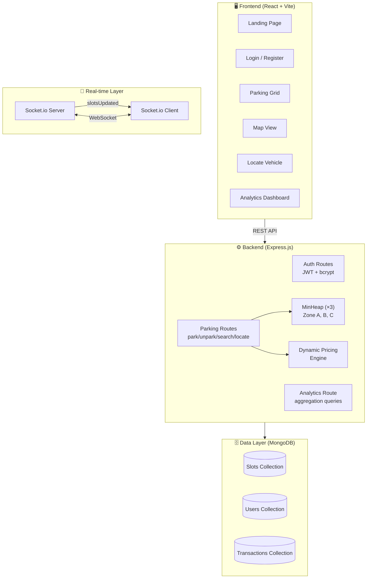
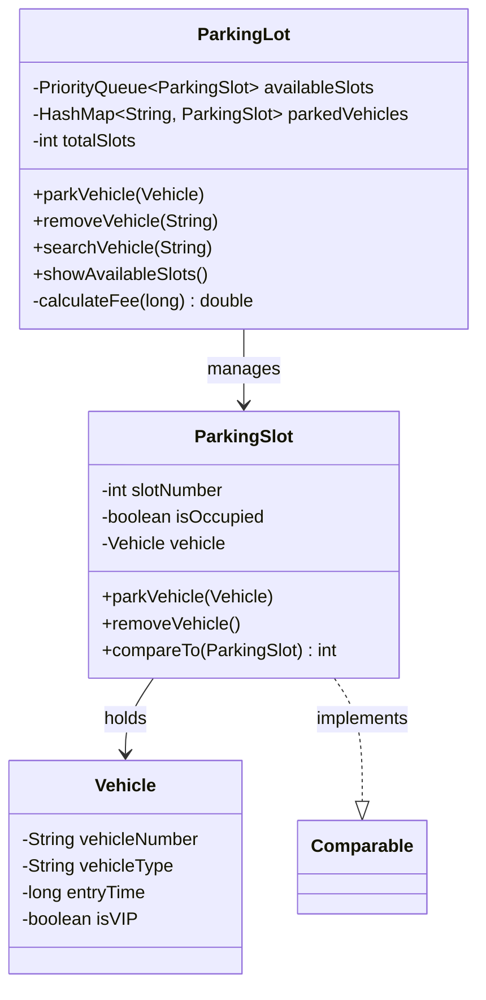
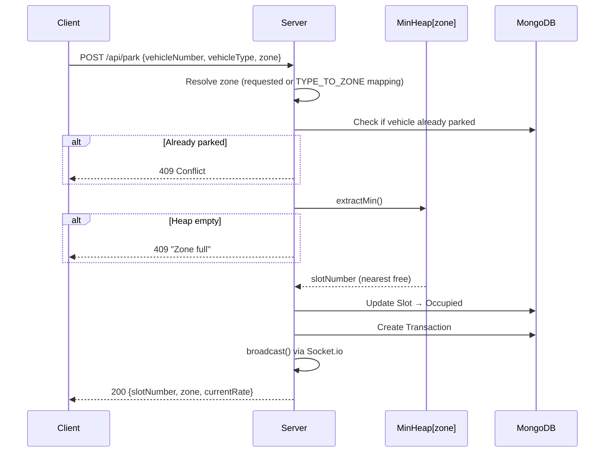
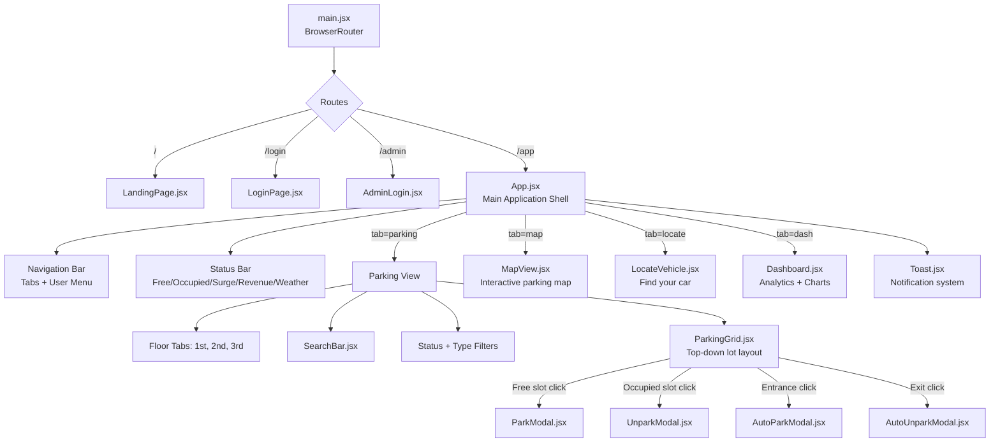
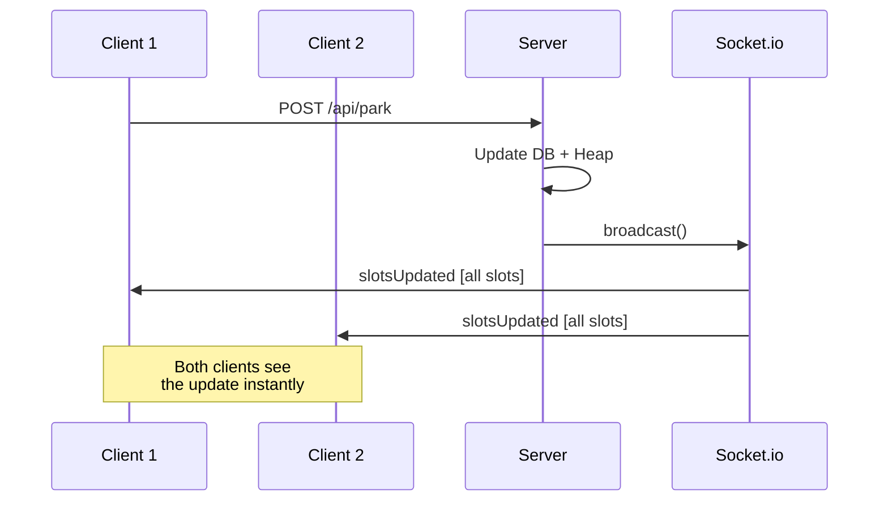
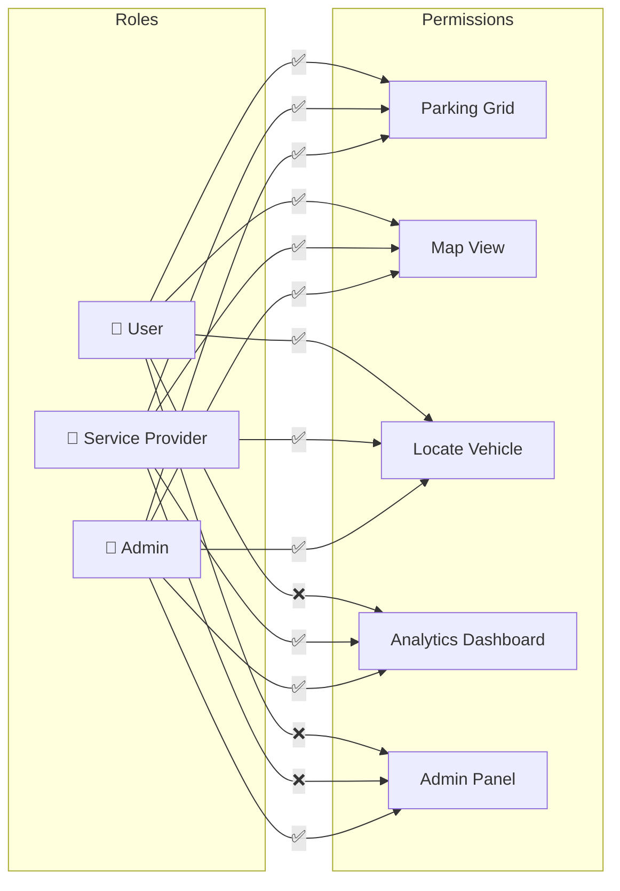
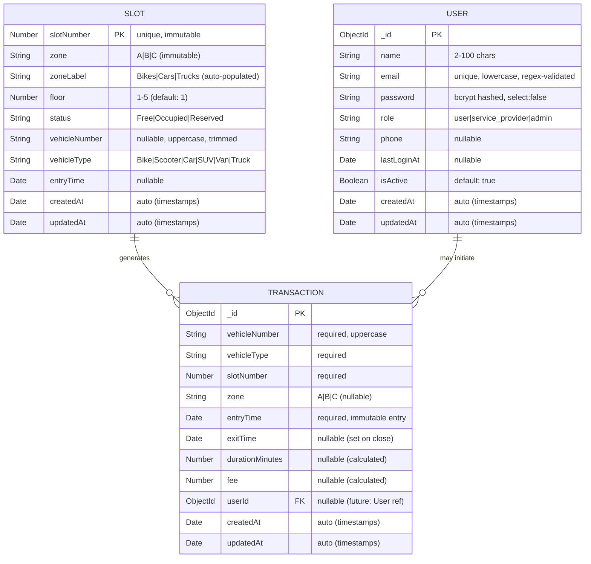
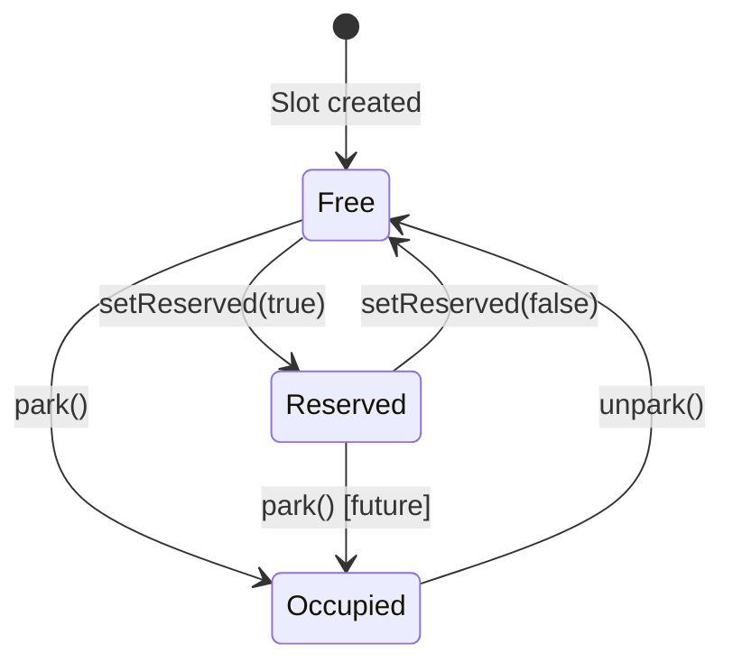
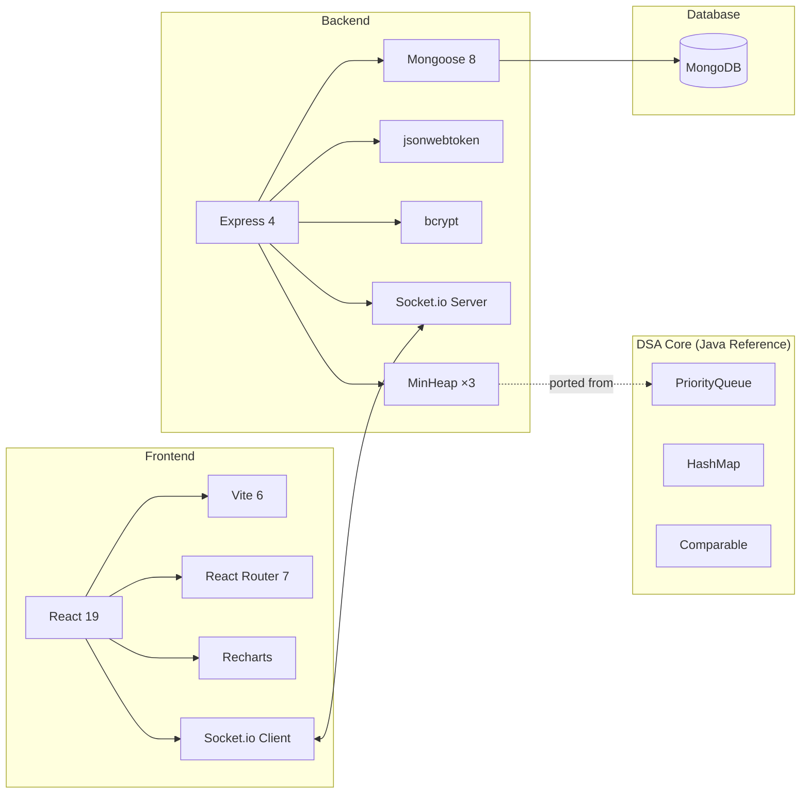

# 🏗️ SmartParkingLot — Architecture Document

> **"Requirements drive architecture. Trade-offs inform decisions. ADRs capture rationale."**

---

## 1. Project Classification

Using the Architecture Decision Framework's **Project Classification Matrix**:

```
                    MVP ◀── YOU ARE HERE
┌──────────────────────────────────────────────────────────────┐
│ Scale        │ <1K users (portfolio/college project)         │
│ Team         │ Solo developer                                │
│ Timeline     │ Fast (weeks)                                  │
│ Architecture │ Simple — Monolith                             │
│ Patterns     │ Minimal — Transaction Script, Active Record   │
│ Tech Stack   │ React + Express + MongoDB + Socket.io         │
└──────────────────────────────────────────────────────────────┘
```

**Classification**: MVP / Academic Portfolio project with production-grade features.

---

## 2. System Overview

### 2.1 High-Level Architecture



### 2.2 Component Inventory

| Layer | Technology | Purpose |
|-------|-----------|---------|
| **Frontend** | React 19 + Vite 6 + React Router 7 | SPA with routing, real-time UI |
| **Styling** | Vanilla CSS (53KB) + Tailwind v4 (dev) | Premium "Electric Blue" design system |
| **Charts** | Recharts | Analytics dashboard visualizations |
| **Real-time** | Socket.io Client | Live slot status updates |
| **Backend** | Express 4 + Node.js | REST API + WebSocket server |
| **Auth** | bcrypt + jsonwebtoken | Password hashing + JWT tokens |
| **Database** | MongoDB (Mongoose 8) | Document store for slots, users, transactions |
| **DSA Core** | MinHeap (JS) + PriorityQueue (Java) | O(log n) nearest-slot allocation |

---

## 3. DSA Core Logic — The Algorithmic Heart

This is the **key differentiator** of the project: demonstrating data structures in a real-world application.

### 3.1 Original Java Implementation



**DSA Concepts Used:**

| Data Structure | Where | Why | Time Complexity |
|---------------|-------|-----|-----------------|
| **Min-Heap (PriorityQueue)** | Slot allocation | Always assigns the nearest (lowest-numbered) slot | Insert: O(log n), Extract: O(log n) |
| **HashMap** | Vehicle lookup | O(1) search by license plate | Lookup: O(1), Insert: O(1) |
| **Comparable Interface** | ParkingSlot ordering | Ensures PriorityQueue sorts by slot number ascending | — |

### 3.2 JavaScript Port (Production)

The Java `PriorityQueue<ParkingSlot>` is ported to a custom **MinHeap** class in `server/utils/MinHeap.js`:

```
Java PriorityQueue<ParkingSlot>  ──►  JS MinHeap (numeric slot numbers)
Java HashMap<String, ParkingSlot>  ──►  MongoDB query (Slot.findOne)
```

**Zone-Based Extension** — The web version extends the Java design with **3 independent heaps**:

```
Zone A (Bikes)  → MinHeap → Slots 1-6    (6 slots)
Zone B (Cars)   → MinHeap → Slots 7-14   (8 slots)
Zone C (Trucks) → MinHeap → Slots 15-20  (6 slots)
                                          ────────
                                          20 total
```

Each zone operates as an independent priority queue, ensuring vehicle-type isolation.

### 3.3 Slot Allocation Flow



---

## 4. Backend Architecture

### 4.1 Server Structure

```
server/
├── index.js              # Bootstrap: DB connect, seed, heap init, mount routes
├── .env                  # MONGO_URI, JWT_SECRET, PORT
├── models/
│   ├── Slot.js           # Parking slot schema (zone, status, vehicle info)
│   ├── User.js           # User schema (bcrypt pre-save, role enum)
│   └── Transaction.js    # Park/unpark transaction log
├── routes/
│   ├── auth.js           # Register, login, admin-login, /me
│   └── parking.js        # Park, unpark, search, locate, analytics, pricing
└── utils/
    ├── MinHeap.js         # Core DSA: O(log n) min-heap
    └── MinHeap.test.js    # Unit tests for heap operations
```

### 4.2 API Surface

| Method | Endpoint | Auth Required | Description |
|--------|----------|:---:|-------------|
| `POST` | `/api/auth/register` | ❌ | Create user/service_provider account |
| `POST` | `/api/auth/login` | ❌ | Login with email/password |
| `POST` | `/api/auth/admin-login` | ❌ | Admin-only login (vague error on failure) |
| `GET` | `/api/auth/me` | ✅ | Get current user info |
| `GET` | `/api/slots` | ❌ | List all slots with status |
| `GET` | `/api/pricing` | ❌ | Dynamic pricing rates |
| `POST` | `/api/park` | ❌ | Park vehicle (uses MinHeap) |
| `POST` | `/api/unpark` | ❌ | Remove vehicle (returns heap, calculates fee) |
| `GET` | `/api/search/:plate` | ❌ | Find vehicle by plate (regex) |
| `POST` | `/api/locate` | ❌ | Locate vehicle with fee estimate |
| `GET` | `/api/analytics` | ❌ | Dashboard aggregations |

### 4.3 Dynamic Pricing Algorithm

```
Price = BaseRate[zone] × (1 + occupied/totalSlots)

Where:
  BaseRate = { A: ₹10/hr, B: ₹30/hr, C: ₹50/hr }
  Multiplier = 1 + (occupiedSlots / totalSlots)

Example at 60% capacity:
  Car rate = ₹30 × 1.6 = ₹48/hr
```

This implements a **surge pricing** pattern — higher occupancy drives higher prices, incentivizing drivers to seek less busy zones.

---

## 5. Frontend Architecture

### 5.1 Component Tree



### 5.2 State Management

The app uses **React local state** (no global store):

| State | Location | Purpose |
|-------|----------|---------|
| `slotsF1`, `slotsF2` | App.jsx | Mock fallback data per floor |
| `slots` | App.jsx | Live slots from Socket.io / API |
| `tab` | App.jsx | Current navigation tab |
| `floor` | App.jsx | Active floor (1, 2, 3) |
| `selectedSlot` | App.jsx | Slot clicked for park/unpark |
| `pricing` | App.jsx | Dynamic pricing from API |
| `filterStatus`, `filterType` | App.jsx | Grid filter controls |
| Auth (`sp_token`, `sp_user`) | localStorage | Persistent auth session |

### 5.3 Offline Resilience Pattern

The frontend implements a **graceful degradation** strategy:

```
1. Try API call (fetch /api/park)
2. If fails → fall back to local state mutation
3. User sees "Parked locally" toast
4. Socket.io reconnection syncs when backend returns
```

This ensures the UI remains functional even if MongoDB or the server is temporarily unreachable.

---

## 6. Real-time Architecture



**Pattern**: Full-state broadcast on every mutation. Simple but effective for 20 slots. Would need delta updates at scale.

---

## 7. Authentication & RBAC



**Auth Flow**: Register → bcrypt hash → JWT (7-day expiry) → localStorage → Role-based UI gating.

---

## 8. Data Model (ERD → MongoDB Schemas)

> **Pattern**: Rich Domain Models — behavior co-located with data (not anemic).
> Schemas derive directly from the ERD below, with added virtuals, methods, and indexes.



### 8.1 Schema Feature Matrix

| Feature | Slot | User | Transaction |
|---------|:----:|:----:|:-----------:|
| **Virtuals** | `isAvailable`, `parkedMinutes`, `baseRate`, `displayLabel` | `isAdmin`, `isProvider`, `displayRole` | `isActive`, `durationHuman`, `feeDisplay`, `slotLabel` |
| **Instance Methods** | `park()`, `unpark()`, `setReserved()` | `comparePassword()`, `hasRole()`, `recordLogin()` | `close(fee)` |
| **Static Methods** | `findByVehicle()`, `searchByPlate()`, `getOccupancy()`, `freeInZone()` | `findByEmail()`, `findAdmin()`, `emailExists()`, `getStats()` | `todayRevenue()`, `hourlyOccupancy()`, `revenueByDay()`, `slotHeatmap()`, `avgDuration()`, `recentHistory()`, `findActive()`, `getDashboard()` |
| **Compound Indexes** | `{zone,status,slotNumber}`, `{vehicleNumber,status}`, `{floor}` | `{role}`, `{isActive}` | `{entryTime}`, `{exitTime}`, `{vehicleNumber,exitTime}`, `{slotNumber}`, `{zone,entryTime}`, `{userId,entryTime}` |
| **Validation** | enum + min/max + custom messages | regex email + minlength + enum | required fields + min constraints |
| **Security** | — | `password: select:false`, bcrypt pre-save hook, `toJSON` strips password | — |
| **Architecture Pattern** | Active Record + State Machine | Active Record + Security Hooks | Event Log (Immutable Append) |

### 8.2 State Machine — Slot Status



### 8.3 Role Hierarchy — RBAC

```
user (1) < service_provider (2) < admin (3)
│                │                    │
├─ Parking Grid  ├─ + Analytics       ├─ + Admin Panel
├─ Map View      └─ + Transactions    └─ + User Management
└─ Locate Vehicle
```


---

## 9. Architecture Decision Records (ADRs)

### ADR-001: Monolith over Microservices

| | |
|---|---|
| **Status** | ✅ Accepted |
| **Context** | Solo developer, <1K users, academic project |
| **Decision** | Single Express.js server handles all concerns |
| **Alternatives** | Separate auth service, parking service, analytics service |
| **Rationale** | Team of 1 doesn't justify microservices overhead. Can extract later. |
| **Trade-off** | All components scale together (acceptable at this scale) |
| **Revisit When** | Team > 3 developers OR different components need independent scaling |

---

### ADR-002: MongoDB over PostgreSQL

| | |
|---|---|
| **Status** | ✅ Accepted |
| **Context** | Document-oriented data (slots, transactions), rapid prototyping |
| **Decision** | MongoDB with Mongoose ODM |
| **Alternatives** | PostgreSQL + Prisma, SQLite |
| **Rationale** | Flexible schema for evolving slot model. Aggregation pipeline for analytics. No complex joins needed. Fast setup. |
| **Trade-off** | No ACID transactions across collections (not needed here). No foreign keys (enforced in app layer). |
| **Revisit When** | Need complex relational queries, multi-document transactions, or strict referential integrity |

---

### ADR-003: MinHeap for Slot Allocation (DSA Choice)

| | |
|---|---|
| **Status** | ✅ Accepted |
| **Context** | Core requirement: always assign nearest available slot |
| **Decision** | Custom MinHeap implementation, one per zone |
| **Alternatives** | Sorted array, database sort query, LinkedList |
| **Rationale** | O(log n) insert & extract vs O(n) for array. Demonstrates PriorityQueue concept from Java. In-memory = no DB roundtrip for allocation. |
| **Trade-off** | Heap state is in-memory (rebuilt on server restart from DB). Not persistent across crashes mid-operation. |
| **Revisit When** | Multiple server instances (need shared state via Redis or DB-based allocation) |

---

### ADR-004: Socket.io for Real-time Updates

| | |
|---|---|
| **Status** | ✅ Accepted |
| **Context** | Multiple users need to see slot changes instantly |
| **Decision** | Socket.io with full-state broadcast |
| **Alternatives** | Server-Sent Events (SSE), polling, WebSocket (raw) |
| **Rationale** | Socket.io provides fallback transport (polling → WebSocket), auto-reconnection, room support for future multi-lot. Broadcasting full state simplifies client logic. |
| **Trade-off** | Full state broadcast = O(n) data per event. Acceptable for 20-40 slots. |
| **Revisit When** | Slots > 500 (switch to delta/diff updates) |

---

### ADR-005: JWT for Authentication

| | |
|---|---|
| **Status** | ✅ Accepted |
| **Context** | Stateless auth needed for SPA, role-based access |
| **Decision** | JWT tokens (7-day expiry) stored in localStorage |
| **Alternatives** | Session-based auth, OAuth 2.0, Passport.js |
| **Rationale** | Stateless = no session store needed. Payload carries role for client-side gating. Simple for solo project. |
| **Trade-off** | No token revocation (logout only clears client). localStorage vulnerable to XSS (acceptable for academic project). |
| **Revisit When** | Need token revocation, refresh tokens, or OAuth social login |

---

### ADR-006: React Local State over Global Store

| | |
|---|---|
| **Status** | ✅ Accepted |
| **Context** | State is mostly co-located in App.jsx |
| **Decision** | `useState` + `useEffect` + prop drilling |
| **Alternatives** | Zustand, Redux, React Context |
| **Rationale** | All state lives in one component (App.jsx). No deeply nested consumers. Adding a store is premature abstraction. |
| **Trade-off** | App.jsx is large (~400 lines) with many state variables. Prop drilling to child components. |
| **Revisit When** | State needed in deeply nested components, or App.jsx exceeds 600 lines |

---

### ADR-007: Dynamic Pricing Strategy

| | |
|---|---|
| **Status** | ✅ Accepted |
| **Context** | Incentivize balanced lot usage, demonstrate real-world pricing algorithms |
| **Decision** | `Price = BaseRate × (1 + occupied/total)` — linear surge model |
| **Alternatives** | Fixed pricing, time-of-day pricing, zone-based tiers, ML-based pricing |
| **Rationale** | Simple, predictable, visually demonstrable. Multiplier ranges from 1.0× (empty) to 2.0× (full). |
| **Trade-off** | Not tuned for real revenue optimization. No time-of-day component. |
| **Revisit When** | Product requires revenue optimization or time-based demand shaping |

---

### ADR-008: Graceful Degradation with Mock Data

| | |
|---|---|
| **Status** | ✅ Accepted |
| **Context** | Frontend must work even without backend connectivity |
| **Decision** | Hard-coded mock slot data (MOCK_SLOTS_F1, MOCK_SLOTS_F2) with local state mutations |
| **Alternatives** | Offline-first with Service Worker + IndexedDB, error-only state |
| **Rationale** | Ensures demo always works. Portfolio presentations don't need live MongoDB. Local mutations give realistic behavior. |
| **Trade-off** | Mock data diverges from real DB. No sync-back mechanism. |
| **Revisit When** | Need true offline-first (use Service Worker + PouchDB sync) |

---

## 10. Identified Architectural Gaps

> These are not bugs — they are conscious trade-offs for an MVP. Documented here for future consideration.

| # | Gap | Severity | Impact | Mitigation |
|---|-----|:--------:|--------|------------|
| 1 | **Parking routes have no auth middleware** | 🟡 Medium | Anyone can park/unpark without logging in | Add `authMiddleware` to parking routes |
| 2 | **Analytics endpoint has no RBAC check** | 🟡 Medium | Any user can hit `/api/analytics` directly | Add role check middleware |
| 3 | **MinHeap is in-memory only** | 🟡 Medium | Server restart requires DB reseed | Already handled by bootstrap — heaps rebuilt from DB on startup |
| 4 | **No rate limiting** | 🟠 Low | Potential abuse of park/unpark endpoints | Add `express-rate-limit` |
| 5 | **Full-state broadcast** | 🟠 Low | Sends all 20+ slots on every change | Acceptable at current scale |
| 6 | ~~Slot schema missing "Reserved" status~~ | ✅ Fixed | ~~Frontend renders "Reserved" but DB enum only has Free/Occupied~~ | Added 'Reserved' to Slot schema enum with `setReserved()` state machine |
| 7 | **No input validation library** | 🟠 Low | Manual validation with no schema enforcement | Add `joi` or `zod` for request validation |
| 8 | **No request logging** | 🟢 Info | Hard to debug production issues | Add `morgan` for HTTP logging |

---

## 11. Future Migration Roadmap

### Phase 1: Harden (Current → Next)
- Add `authMiddleware` to parking and analytics routes
- Add `Reserved` to Slot status enum
- Add `express-rate-limit`
- Add `morgan` for request logging
- Write more MinHeap unit tests

### Phase 2: Scale (If Users > 100)
- Extract MinHeap state to **Redis** for multi-instance support
- Switch from full-state broadcast to **delta updates** via Socket.io
- Add **pagination** to analytics queries
- Add **Zustand** or **React Context** for state management

### Phase 3: Production (If Deployed Publicly)
- Move JWT to **httpOnly cookies** (mitigate XSS)
- Add **refresh token** rotation
- Add **Helmet.js** for security headers
- Add **OpenTelemetry** for observability
- Consider **PostgreSQL** for ACID transactions on payments

---

## 12. Tech Stack Summary Diagram



---

## 13. Decision Log Summary

| # | Decision | Chosen | Key Reason |
|---|----------|--------|------------|
| 1 | App Structure | Monolith | Solo developer, MVP scope |
| 2 | Database | MongoDB | Flexible schema, aggregation pipeline |
| 3 | Slot Allocation | MinHeap (custom) | O(log n), DSA showcase |
| 4 | Real-time | Socket.io | Auto-fallback, broadcast simplicity |
| 5 | Authentication | JWT + bcrypt | Stateless, role-carrying payload |
| 6 | State Management | React useState | Co-located state, no deep nesting |
| 7 | Pricing | Linear surge formula | Simple, demonstrable, predictable |
| 8 | Offline Strategy | Mock data fallback | Demo resilience, portfolio-friendly |

---

> **Document Status**: Complete  
> **Last Updated**: 2026-03-29  
> **Applies To**: SmartParkingLot v1.0  
